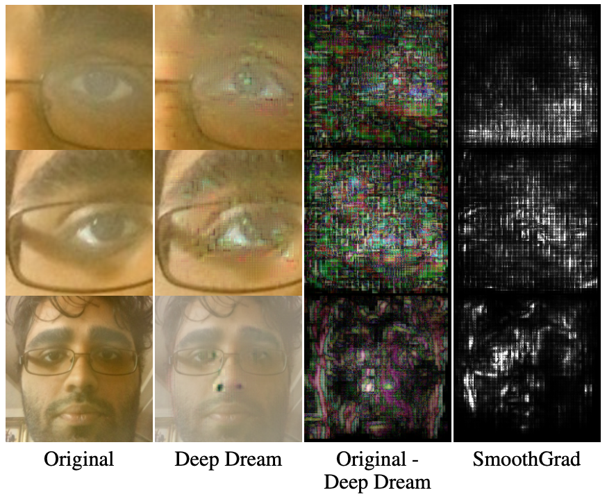

<h1 align="center"> Explaining Eyetracking CNNs </h1>
<h1 align="center">
  
</h1>
<h2 align="center"> Authors </h2>

[Sid Gupta*](cs.toronto.edu/~sidgupta/), 
[David Canegesabey*](https://github.com/dtcan), 
[Melissa Halim Lee*](https://www.linkedin.com/in/melissahalimlee/?originalSubdomain=ca)

<h2 align="center"> Abstract </h2>

Eye-tracking technology provides accessibility to many kinds of people; such as individuals with motor control disabilities. The task is difficult, however, because a subtle mixture of head, pupil, and face movements can correspond to a large difference in screen coordinates, as shown in physiology research. Current state-of- the-art neural networks, such as iTracker, intake both zoomed-in pupil images and zoomed-out face images, and show exceptional empirical results with eyetracking. However, a concrete interpretibility study has yet to be done on iTracker, and it’s unknown if the model actually accumulates small differences in the head, pupil, and face movements when making predictions. In this paper, we perform such a study by applying Deep Dream and SmoothGrad on the iTracker model. We isolate the zoomed-in pupil branches from the network, and compare their Deep Dream and SmoothGrad results with the whole iTracker model. Our results show that the zoomed-in branches alone require large differences to change screen positioning, whereas the whole iTracker model only requires small differences. Thus, we conclude that the whole iTracker model indeed converges with physiology research by collecting small differences in the head, face, and pupil movements, and that’s plausibly why it’s so accurate.

### Running the Code

The algorithms and ablation study is impemented in  [`explaining_itracker.ipynb`](https://github.com/sidguptacode/Interpreting_Eyetracking_CNNs/blob/master/src/explaining_itracker.ipynb). You can view the notebook with the GitHub viewer, or run it yourself on Colab or in Jupyter on your local machine.

### More Details 
View our [`explaining_itracker.pdf`](https://github.com/sidguptacode/Interpreting_Eyetracking_CNNs/blob/master/explaining_itracker.pdf) for more information. 

